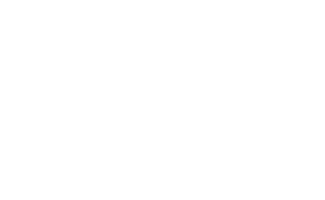

<div align="center">



# dat.ai MCP

*Browser automation, transcription, and LLM chat — as MCP tools for any agent.*


</div>

---

## Tools

| Tool | Endpoint | Description |
|------|----------|-------------|
| `dat_browse` | `POST /api/v1/browsing/{async,sync}` | Natural language browser automation. Sync (waits up to 10 min) or async (returns task_id immediately). Optional screenshots |
| `dat_browse_status` | `GET /api/v1/browsing/status` | Poll an async browsing task. Returns status + result if ready |
| `dat_browse_screenshot` | `GET /api/v1/browsing/screenshots/{task_id}/{file}` | Download a screenshot as base64 image data |
| `dat_transcribe` | `POST /api/whisper/transcribe/{async,sync}` | Whisper speech-to-text. Accepts audio URL or base64. Sync or async |
| `dat_transcribe_status` | `GET /api/whisper/transcribe/status` | Poll an async transcription task |
| `dat_completions` | `POST /v1/chat/completions` | OpenAI-compatible chat completions. Streaming, function calling, built-in dat.ai tools (net/fs/webview) |
| `dat_chat` | `POST /api/chat` | Ollama-compatible chat. NDJSON streaming, system prompts, built-in tools |

## Setup

### Get an API key

Sign up at [dat.ai](https://dat.ai) and get your API key from the dashboard.

### Configure your MCP client

Set the `DAT_AI_API_KEY` environment variable and add the server to your MCP client config

#### Hermes Agent

Add to `~/.hermes/config.yaml` under `mcp_servers`:

```yaml
mcp_servers:
  dat-ai:
    command: npx
    args:
      - -y
      - dat.ai-mcp
    env:
      DAT_AI_API_KEY: your-api-key-here
    timeout: 600
```

#### Claude Desktop

Add to `claude_desktop_config.json`:

```json
{
  "mcpServers": {
    "dat-ai": {
      "command": "npx",
      "args": ["-y", "dat.ai-mcp"],
      "env": {
        "DAT_AI_API_KEY": "your-api-key-here"
      }
    }
  }
}
```

#### Cursor / other MCP clients

Same pattern: command `npx`, args `["-y", "dat.ai-mcp"]`, env `DAT_AI_API_KEY`

### Environment variable

```
DAT_AI_API_KEY=your-api-key-here
```

## Usage examples

### Browser automation

```
dat_browse({
  task: "Open https://example.com and summarize the page",
  screenshots_mode: "final_only"
})
```

### Audio transcription

```
dat_transcribe({
  audio_url: "https://example.com/audio.mp3"
})
```

### Chat completions with built-in tools

```
dat_completions({
  model: "qwen3:1.7b",
  messages: [{ role: "user", content: "Open https://example.com and summarize the page" }],
  datai_tools: { net: true, webview: true }
})
```

## Development

```bash
git clone https://github.com/willtholke/dat.ai-mcp.git
cd dat.ai-mcp
npm install
npm run build
```

## License

MIT

---

<div align="center">

<sub>Built by [Will Tholke](https://github.com/willtholke). Powered by [dat.ai](https://dat.ai).</sub>

</div>